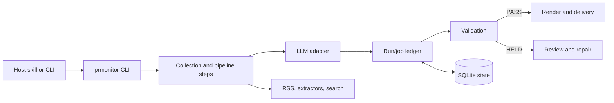

# Architecture

PR Monitor turns RSS and news-search inputs into two kinds of briefings:

- `market`: an industry briefing with source-backed insights.
- `self`: a company PR briefing with mention and tone analysis.

The same Python core is packaged for Claude Code, Codex, and Hermes-compatible
hosts. Host integrations supply skills and an LLM command; business rules,
storage, validation, rendering, and delivery remain host-neutral.

## Runtime flow

## Main modules

| Area | Location | Responsibility |
|---|---|---|
| CLI and compatibility commands | `prmonitor/__main__.py`, `prmonitor/steps/` | Parse requests and retain legacy workflow entry points. |
| Orchestration | `prmonitor/services/` | Plan jobs, track runs, validate results, and coordinate recovery. |
| Durable state | `prmonitor/storage/` | SQLite migrations, run/job attempts, artifact checksums, and cache metadata. |
| Contracts | `prmonitor/models.py`, `prmonitor/contracts/` | Run state, immutable request/result identifiers, and bundled schemas. |
| LLMs | `prmonitor/llm/`, `prmonitor/steps/llm_adapter.py` | Claude, Codex, and generic/Hermes command adapters. |
| Quality boundary | `prmonitor/validation.py`, `prmonitor/render.py`, `prmonitor/delivery.py` | Hold invalid work, render only approved content, and gate delivery. |

## Safety invariants

- A required job must succeed before a run can become `READY`.
- Job results are scoped to a run, job, and request hash. Completed results are not overwritten.
- A repaired job receives a new request hash; stale responses are rejected.
- A `PASS` report must match the briefing, policy, and rendered HTML before delivery.
- Delivery reserves a `(run, artifact, recipient)` dedupe key before invoking a transport.
- `HELD` is recoverable: complete the required work or correct the briefing, then validate again.

## Host support

| Host | Bundle format | Runtime command |
|---|---|---|
| Claude Code | `.claude-plugin/plugin.json` | `claude -p` |
| Codex | `.codex-plugin/plugin.json` | `codex exec` |
| Hermes | `plugin.yaml` | Native skill registration or `PRM_SYNTH_CMD` generic adapter |

See the root [README](../README.md) for setup and use, [USAGE](../USAGE.md) for configuration, and [OPERATIONS](OPERATIONS.md) for diagnosis and recovery.
