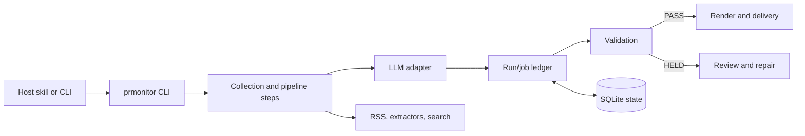

# 구조와 안전 경계

PR Intelligence는 RSS와 뉴스 검색 결과를 두 종류의 브리핑으로 만듭니다.

- `market`: 출처와 시사점이 연결된 시장 인텔리전스 브리핑
- `self`: 자사 언급·톤·보도 맥락을 기록하는 자사 PR 브리핑

Claude Code, Codex, Hermes 호환 환경은 같은 Python 엔진을 사용합니다. 호스트별 스킬과 LLM 실행 명령만 달라지고, 수집·저장·검증·렌더·발송의 업무 규칙은 공통입니다.

## 정식 명령과 내부 도구

일상 운영에서는 `market-brief`, `self-brief-daily`, `self-brief`, `init`, `doctor`만 사용합니다. `pre`, `post`, run ledger·복구 명령은 테스트와 장애 진단을 위한 내부 도구이며, 일반 사용 흐름이나 README에는 노출하지 않습니다.

정식 명령은 Python step orchestrator가 조율합니다. `scripts/`는 수집·분류·렌더 같은 결정론적 세부 작업을 담당하며, 별도의 최상위 실행 경로가 아닙니다.

## 실행 흐름

## 주요 구성 요소

| 영역 | 위치 | 역할 |
|---|---|---|
| CLI·호환 명령 | `prmonitor/__main__.py`, `prmonitor/steps/` | 요청을 해석하고 기존 자동화의 진입점을 유지합니다. |
| 실행 조율 | `prmonitor/services/` | 작업을 계획하고 실행 기록·검증·복구를 조율합니다. |
| 영속 상태 | `prmonitor/storage/` | SQLite 마이그레이션, 실행·작업 시도, 산출물 체크섬, 캐시 메타데이터를 관리합니다. |
| 계약 | `prmonitor/models.py`, `prmonitor/contracts/` | 실행 상태, 변경 불가한 요청·결과 식별자, 번들 스키마를 정의합니다. |
| LLM 연결 | `prmonitor/llm/`, `prmonitor/steps/llm_adapter.py` | Claude, Codex, 범용/Hermes 명령 어댑터를 연결합니다. |
| 품질 경계 | `prmonitor/validation.py`, `prmonitor/render.py`, `prmonitor/delivery.py` | 검증에 실패한 결과를 보류하고, 승인된 내용만 렌더·발송합니다. |

## 반드시 지키는 안전 규칙

- 필수 작업이 모두 성공해야 실행 상태가 `READY`가 됩니다.
- 작업 결과는 실행·작업·요청 해시에 묶입니다. 완료된 결과는 덮어쓰지 않습니다.
- 복구한 작업에는 새 요청 해시를 부여하며, 이전 응답은 거절합니다.
- 발송 전 `PASS` 검증 보고서는 브리핑·정책·렌더 HTML과 정확히 일치해야 합니다.
- 발송은 `(실행, 산출물, 수신자)` 중복 방지 키를 먼저 확보합니다.
- `HELD`는 복구 가능한 상태입니다. 필요한 작업을 끝내거나 브리핑을 고친 뒤 다시 검증합니다.

## 실행 환경 지원

| 환경 | 번들 형식 | 실행 명령 |
|---|---|---|
| Claude Code | `.claude-plugin/plugin.json` | `claude -p` |
| Codex | `.codex-plugin/plugin.json` | `codex exec` |
| Hermes | `plugin.yaml` | 네이티브 스킬 등록 또는 `PRM_SYNTH_CMD` 범용 어댑터 |

설치·실행은 [README](../README.md), 조직별 설정은 [USAGE](../USAGE.md), 장애 점검·복구는 [OPERATIONS](OPERATIONS.md)를 참고하세요.
