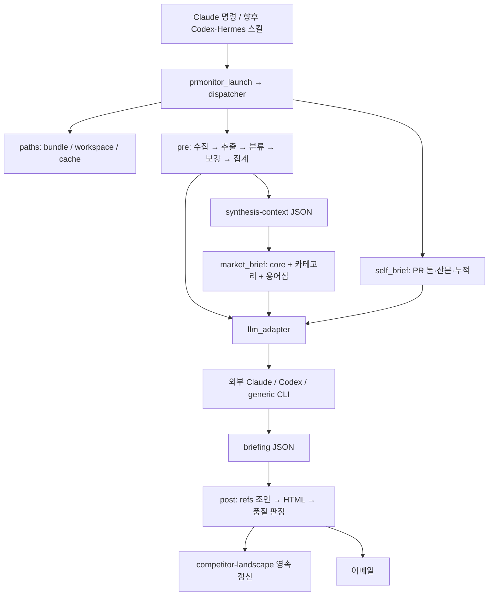

# 경량 멀티호스트 플러그인 아키텍처 감사

- 일자: 2026-09-15
- 기준 커밋: `7842f0cae09e6e54813e2a349853dbde50b54ecf`
- 결론: 공통 Python 엔진 재사용은 가능하다. 현재 상태를 세 호스트용 완성 플러그인 또는 무인 운영 가능한 파이프라인으로 판단할 수는 없다.
- 이번 작업: CodeGraph 설치, 의존성 설치, 기존 테스트 및 실패 시나리오 실행, 보고서/재현 스크립트 작성. 제품 코드 수정이나 플러그인 배포는 하지 않았다.

## 1. 검증 결과

| 검증 | 결과 |
|---|---|
| Python 3.12 환경에 requirements-dev.txt 설치 | 성공, 35개 패키지 |
| 기존 테스트 | 134 passed, 14.80초 |
| CodeGraph 구조 분석 | 60개 파일, 도구 기준 525개 함수, 순환 의존성 0개 |
| Codex CLI 0.149.1 어댑터 옵션 | 실패: `--full-auto` 미지원 |
| Claude Code 2.1.270 | 바이너리 확인; 실제 LLM 전체 파이프라인 미검증 |
| Hermes CLI | Python venv 경로가 없어 실행 실패 |
| 합성 전체 실패 주입 | 빈 briefing 생성 → 경고 0개 → 발송 함수 진입, exit 0 |
| 수집창 24→72시간 확대 | 수집/집계 재실행, synthesis-context는 이전 내용 유지 |
| generic 프롬프트 전달 | 공백으로 인자 분리, 작은따옴표에서 ValueError |
| 공개 CLI dry-run/no-email | 두 옵션 모두 argparse exit 2 |

실제 뉴스 수집부터 LLM 생성까지의 유료 end-to-end와 메일 실발송은 실행하지 않았다. 실패 재현에서는 LLM을 실패 함수로, 메일을 기록 함수로 대체했다. 실제 resolver와 HTML formatter는 실행했다. 테스트 통과는 이 미검증 구간의 정상 동작을 보장하지 않는다.

## 2. CodeGraph 설치 및 분석 범위

[CodeGraph 공식 저장소](https://github.com/codegraph-ai/CodeGraph)의 v0.20.1 macOS arm64 바이너리를 설치하고 배포 SHA-256을 검증했다.

- 바이너리: `/Users/namseoa/.local/share/codegraph/v0.20.1/codegraph-server-darwin-arm64`
- 실행 링크: `/Users/namseoa/.local/bin/codegraph-server`
- 전역 호스트 MCP 설정은 변경하지 않았다. 이번 분석은 one-shot CLI로 실행했다.

```bash
codegraph-server --graph-only --workspace "$PWD" \
  --run-tool codegraph_generate_architecture_doc --tool-args '{"topN":10}'
codegraph-server --graph-only --workspace "$PWD" \
  --run-tool codegraph_find_circular_deps --tool-args '{}'
```

산출물: `codegraph-architecture.md`, `codegraph-llm-calls.json`, `codegraph-cycles.json`.

이번에는 AST 기반 심볼·호출·의존 관계를 분석했다. `--graph-only`이므로 임베딩 기반 자연어 의미 검색은 수행하지 않았다. 525개 함수는 YAML 항목 등까지 포함하는 도구 통계이며 Python 함수만의 수가 아니다. 동적 backend dispatch, subprocess로 실행하는 Python 파일, 프롬프트가 지정한 JSON 입출력 연결은 그래프만으로 완전하게 추적되지 않으므로 코드 읽기와 실행 재현으로 보완했다. 순환 미검출은 무결함 판정이 아니다.

복잡도 집중 지점: `render_pr_clipping.main` 155, `format.build_html` 69, `format.attach_inline_refs` 53, `market_brief._run_parallel_synth` 44. 복잡도는 우선 검토할 위치를 나타낼 뿐 그 자체가 버그는 아니다.

## 3. 실제 의미적 관계



좋은 경계는 `paths`, 도메인팩, `llm_adapter`이다. 핵심 취약점은 프로세스 간 계약이다. LLM 작업 성공 여부를 파일 존재로 추정하며, 파일에는 실행 ID·완료 상태·검증 결과가 없다. 전처리도 파일 존재로 캐시를 재사용한다. 따라서 파일이 있다는 사실과 최신·완전·유효한 데이터라는 사실이 혼동된다.

## 4. 확인된 결함 — 우선순위순

### P1: 합성이 전부 실패해도 정상 발송 경로에 도달

- `prmonitor/steps/market_brief.py:293` 이후 실패 결과를 최종 실패로 전달하지 않고 빈 구조를 머지해 파일을 생성한다.
- `skills/briefing-formatter/format.py:425` 검증은 존재하는 문장 중심이며 필수 TL;DR·insights·카테고리 누락을 막지 않는다.
- 재현: 모든 LLM 호출이 rc=1 → briefing_exists=True, quality_warnings=[], post rc=0, would_send=True.
- 수정 방향: 필수 작업의 성공·JSON schema·카테고리 완전성 검증 후에만 최종 briefing을 원자적으로 확정. 실패 시 HELD/FAILED 명시. 빈 입력과 합성 실패를 구분.

### P1: 현재 Codex CLI와 기본 argv가 불일치

- `prmonitor/steps/llm_adapter.py:151`: `codex exec --full-auto` 고정.
- 로컬 0.149.1은 `unexpected argument '--full-auto'`로 즉시 종료.
- 수정 방향: 지원 CLI 버전을 명시하고 호환되는 실행 계약을 구현. `job.add_dir`, cwd, effort, text/file 모드도 호스트별로 매핑해야 한다. 옵션 한 개를 없애는 것으로 경로 권한까지 검증된 것은 아니다.

### P1: 수집창 확대 시 오래된 합성 컨텍스트 재사용

- `prmonitor/steps/pre.py:132`: 확대 시 urls/extracted/classified/facts를 삭제하지만 synthesis-context는 남긴다.
- `pre.py:238`: 남아 있는 컨텍스트를 skip.
- 24→72시간 재현에서 신규 facts 생성 후에도 컨텍스트는 `{"stale":true}` 유지.
- 수정 방향: downstream 전체 무효화. 장기적으로 collection timestamp, hours, config hash, 입력 hash를 캐시 키/manifest에 포함. 현재 날짜 단위 이름은 동일 날짜 재실행과 동시 실행도 구분하지 못한다.

### P1: 출처 검증 장애가 발송 보류로 연결되지 않음

- `prmonitor/steps/post.py:190`: resolve-refs rc=2만 보류하고 그 외 오류는 경고 후 계속한다.
- `post.py:84`: 품질 경고 파일 없음/파싱 실패를 0개로 처리.
- 이는 실행 코드에서 확인한 fail-open 경로다. 별도 재현에서 없는 경고 파일이 0을 반환했다. 모든 장애 조합을 실발송으로 시험하지는 않았다.
- 수정 방향: 검증 실패·미실행·결과 손상을 PASS와 구분하고 HELD로 처리.

### P2: Codex/Hermes 용어집 단계에 Claude 모델명이 유출

- `prmonitor/steps/market_brief.py:353`: glossary 기본값은 backend와 무관하게 `claude-sonnet-4-6`.
- Codex 실패 주입 로그에서 실제 해당 모델명이 전달되는 것을 확인.
- 수정 방향: backend별 기본값 정책을 하나로 통합하고 모든 LLM 작업에 적용.

### P2: generic 명령 템플릿이 프롬프트를 손상

- `prmonitor/steps/llm_adapter.py:195`: 문자열 치환 후 shlex.split을 수행.
- `echo {prompt}` + `What's new?` → ValueError. 여러 단어는 여러 argv로 쪼개짐. 따옴표로 템플릿을 감싸도 사용자 본문에 같은 따옴표가 있으면 취약하다.
- 수정 방향: 템플릿을 먼저 토큰화한 뒤 각 토큰 안의 placeholder 치환, 가능하면 stdin 전달. prompt_file 임시 파일 삭제 수명주기도 필요.
- shell=True가 없으므로 이것을 셸 명령 실행 취약점으로 단정하지 않는다.

### P2: 공개 CLI에 no-email/dry-run 누락

- `prmonitor/__main__.py:63` build_parser에 옵션 등록이 없다. 내부 run()은 속성을 읽지만 launcher 경유 사용자는 전달할 수 없다.
- `commands/newsletter.md`는 delivery.yaml이 없으면 `--no-email`을 추가하라고 안내해 실제로 실패를 유발한다.
- 또한 pre는 enrich-articles를 호출하므로 dry-run을 'LLM 호출 없음'으로 정의하려면 pre에도 정책을 전달해야 한다.
- 수정 방향: 공개 parser→모든 단계로 명시적 옵션 전파, dry-run 의미 정리.

### P2: 품질 보류 콘텐츠가 장기 맥락에 반영될 수 있음

- `prmonitor/steps/post.py:241`: hold_reasons가 있어도 update-landscape 실행.
- 발송은 보류해도 그 근거가 다음 실행의 self-context에 들어갈 수 있다. 순서는 코드에서 확인했으며 실제 회사 데이터 오염은 시험하지 않았다.
- 수정 방향: 승인된 업데이트만 영속 반영하고 나머지는 후보 저장소로 분리.

## 5. 호스트별 준비 상태

| 호스트 | 현재 상태 | 필요한 작업 |
|---|---|---|
| Claude Code | manifest/commands/hook 존재, 가장 가까움 | 위 데이터 무결성 수정, 실제 설치 및 nested CLI 실행 검증 |
| Codex | backend stub 존재, 전용 배포 manifest 부재 | `.codex-plugin` 패키징, 공통 스킬 진입점, argv·작업 경로·결과 계약 |
| Hermes | 이름만 hermes인 generic command adapter | 실제 Hermes CLI 계약, 스킬/플러그인 패키징, 로컬 Hermes venv 복구 |

기존 스킬도 그대로 이식되지는 않는다. article-extractor는 `${CLAUDE_SKILL_DIR}`, briefing-formatter는 없는 `.claude/skills/...`와 폐기된 run-post.sh를 안내한다. bundle 기준 스크립트 경로와 공통 CLI로 정리해야 한다.

기본 `PRM_*` 경로를 지정하지 않으면 bundle root가 workspace/cache도 겸한다. 따라서 읽기 전용 설치 위치에서 사용자 데이터가 안전하게 분리된다는 보장은 호스트 래퍼가 세 경로를 설정할 때만 성립한다.

[OpenAI 플러그인 안내](https://learn.chatgpt.com/docs/plugins)와 [공식 플러그인 예제](https://github.com/openai/plugins)는 플러그인 배포 모델의 참고 자료다. [Hermes 스킬 작성 문서](https://hermes-agent.nousresearch.com/docs/developer-guide/creating-skills)는 스킬을 새 기능 추가의 우선 방식으로 안내한다. Hermes의 [플러그인 개발 문서](https://hermes-agent.nousresearch.com/docs/developer-guide/plugins)도 별도 확인했다. 한 호스트 manifest가 세 호스트에서 동일하게 설치된다고 가정하면 안 된다.

## 6. 권장 경량 아키텍처

**공통 엔진 하나 + 공통 워크플로 스킬 + 얇은 호스트별 설치 어댑터**가 적합하다. 현재 엔진을 전면 재작성할 필요는 없다.

1. Python core: collect/extract/classify/validate/render. 가능한 한 typed JSON 입출력과 함수 호출로 경계를 정리.
2. 대화형 실행: 현재 호스트의 LLM이 정해진 synthesis 입력을 받아 JSON 작성 → Python 검증/렌더. 중첩 headless agent를 기본값으로 두지 않아 세션 시작·규칙 로딩 비용 절감.
3. 무인 실행: 별도 CLI adapter가 같은 synthesis 계약 수행. timeout, 제한된 retry, 완료 manifest, 모델 선택, cwd를 명시.
4. 실행 상태: run_id별 디렉터리와 atomic commit. SUCCESS / HELD / FAILED 및 generation/delivery 상태 분리.
5. 설치: `prm doctor`, `prm init`, `prm collect`, `prm validate`, `prm render`, `prm send` 같은 명시적 인터페이스. 이는 제안이며 현재 구현되어 있지 않다.
6. 배포: venv·CodeGraph를 제품 패키지에 넣지 않고 runtime은 설치 시 준비. CodeGraph는 개발용 분석 의존성으로 유지.

현재 prmonitor+scripts+skills는 로컬 측정 약 800KB, 테스트 포함 venv는 약 92MB다. 패키지 크기보다 호출 비용이 더 큰 개선 대상이다. 정상 병렬 뉴스레터 합성은 core 1 + 카테고리 N + glossary 1 = N+2 세션이고, 기사 보강은 별도다. 카테고리 6개면 재시도 전에도 합성만 8세션이다.

## 7. 권장 구현 순서와 완료 기준

1. P1 결함 수정 및 실패 주입 회귀 테스트.
2. 공통 backend 계약, 공개 no-email/timeout/doctor, 경로 분리.
3. 세 호스트용 스킬/설치 계층 작성.
4. 호스트별 별도 임시 workspace에서 init → 수집 → 실제 LLM → JSON 검증 → HTML end-to-end.
5. 마지막으로 별도 허가된 수신자를 통한 이메일 전달 검증.

출시 기준: 합성 실패/잘못된 JSON/출처 검증 장애에서는 발송되지 않아야 함. 수집창 변경 시 컨텍스트 갱신. 업데이트 후 사용자 데이터 보존. 동일 날짜 중복 실행 격리. 모든 호스트에서 같은 입력·출력 계약 만족.

## 재현

```bash
.venv/bin/python -m pytest tests -q
.venv/bin/python docs/architecture-audit/reproduce.py
```

재현 스크립트는 임시 workspace/cache를 사용하고 LLM 호출·메일 전송을 대체한다. 원본 회사 설정은 변경하지 않는다. 세부 출력은 `reproduction-results.txt`, 기존 테스트 결과는 `pytest-baseline.txt` 참고.
