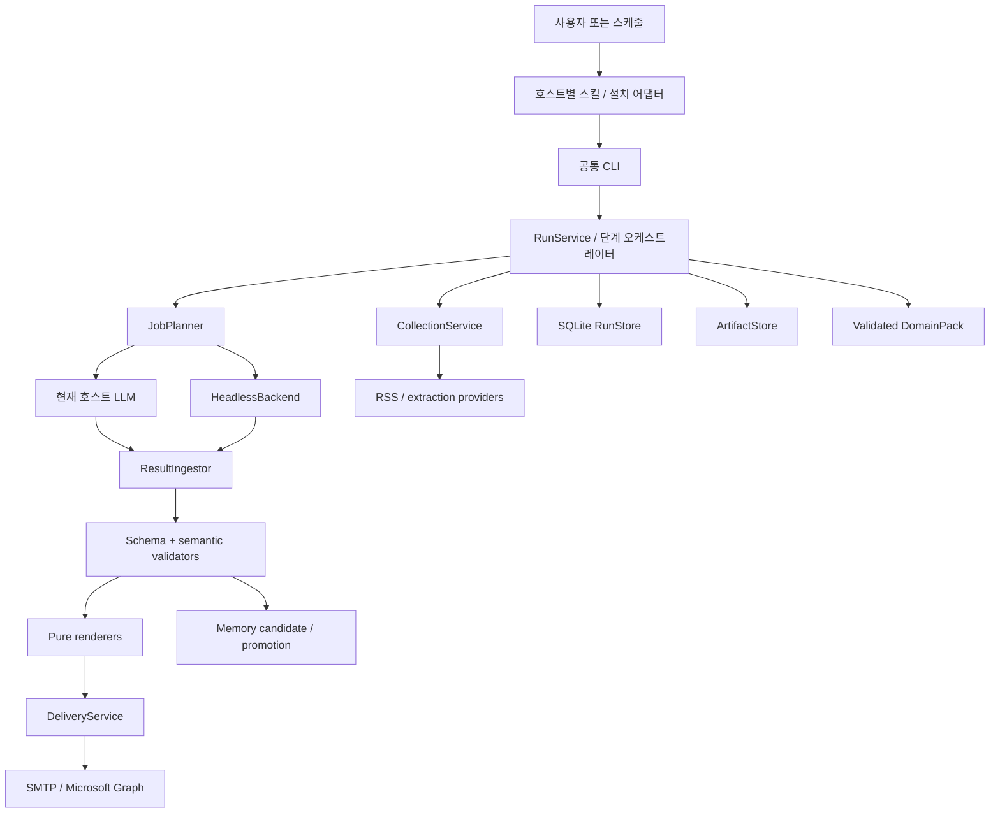

# 01. 기술 아키텍처

## 1. 전체 구성



외부 I/O는 collection·backend·delivery 모듈에 한정한다. renderer/validator/normalizer는 네트워크·LLM·전송을 수행하지 않는다. 호스트 어댑터는 도메인 로직을 소유하지 않는다.

## 2. 목표 파일 배치

```text
prmonitor/
  __main__.py                 # argparse → service, stdout JSON/stderr log
  paths.py                    # PathContext 생성, legacy 상수 shim
  bootstrap.py                # interpreter/venv/versioned deps
  domainpack.py               # 명시 workspace별 config snapshot
  models.py                   # dataclasses/enums, JSON 변환
  errors.py                   # 코드별 도메인 예외
  services/
    runs.py                   # create/prepare/ingest/validate/render/resume
    jobs.py                   # single/split/enrichment 작업 계획
    collection.py             # fetch/extract/classify/aggregate 순서
    memory.py                 # candidate/promote/rebuild views
    delivery.py               # gate + reservation + transport + receipt
  storage/
    database.py               # sqlite schema/migration/transaction
    runs.py                   # 상태 전이, lease, revision
    artifacts.py              # bytes/hash/atomic write/path containment
    cache.py                  # content-addressed cache manifests
  contracts/
    __init__.py               # bundled schema 읽기
    *.schema.json             # 외부 ref 없는 draft 2020-12 schemas
  validation/
    schema.py                 # jsonschema validator
    briefing.py               # 필수 구조·coverage·unknown ref
    quality.py                # 기존 스타일 규칙 wrapper
    policy.py                 # findings → PASS/HELD
  llm/
    base.py                   # Backend protocol, JobResult
    process.py                # deadline/termination/logging/cleanup
    claude.py
    codex.py
    generic.py
    hermes.py                 # 검증된 공식 CLI profile만 지원
    models.py                 # model/effort resolution
  pipelines/
    articles.py               # canonical Article와 ID/URL normalize
    classify.py               # 기존 함수 이동
    aggregate.py              # 기존 tier/중복 규칙 보존
    context.py                # LLM 입력 생성·사이즈 제한
    pr.py                     # mention/tone/PR records, 네트워크 없음
  renderers/
    newsletter.py             # 기존 format 구현 이동 또는 초기 wrapper
    pr.py                     # 순수 PR HTML
    exports.py                # CSV/XLSX, formula escaping
    legacy.py                 # v1 contracts → 기존 formatter dict
  delivery/
    smtp.py
    microsoft_graph.py
  steps/                      # 기존 CLI 호환 thin wrappers
scripts/
  pipeline/*                  # 한시적 CLI shim; 중복 로직 금지
  pr/*                        # 한시적 CLI shim
  demo/build_samples.py
  packaging/build.py
adapters/
  claude/                     # manifest, hook, commands templates
  codex/                      # .codex-plugin manifest template
  hermes/                     # plugin.yaml + __init__.py
skills/
  pr-monitor/                 # 자사 PR workflow
  market-brief/               # 뉴스레터 workflow
  pr-setup/                   # 설정/doctor
  article-extractor/          # 기존 호환 skill
  briefing-formatter/         # 기존 호환 skill
prompts/                      # 호스트 문법 없는 순수 지침
config-templates/
  defaults/                   # 산업 무관 실행 기본값
  examples/contoso/           # 회사/산업 예시: explicit example mode
```

모든 디렉터리를 T02에서 빈 파일로 만들지 않는다. 각 티켓에서 실제 사용하는 모듈만 만든다. 이동 후 기존 script entrypoint는 thin wrapper로 남겨 마이그레이션 동안 기존 호출을 지킨다.

## 3. 의존 규칙

| 모듈 | 허용 의존 | 금지 의존 |
|---|---|---|
| models/errors | stdlib | paths global, network, CLI |
| storage | models/errors/path context | renderer, backend |
| domainpack | pathlib/yaml/models | 호스트 CLI, LLM |
| pipelines | models/config + 순수 helpers | 환경변수 직접 읽기, 이메일 |
| validation | schema/models/config | 외부 LLM 검증을 필수 PASS 조건으로 삼기 |
| renderers | validated view model | 수집·합성·전송·DB 상태 수정 |
| llm | models/process | renderer/이메일/메모리 |
| delivery | validated artifact + transport | 미검증 임의 HTML 전송 |
| services | 위 모듈 | 호스트 UI 직접 제어 |
| adapters/skills | 공통 CLI 계약 | 자체 분류/품질/캐시 로직 |

`os.environ` 해석은 CLI/config/backend 초기화에 한정한다. import만으로 mkdir, config load, 실행 날짜 결정, CLI probe가 일어나지 않게 한다. 기존 import-time 상수는 compatibility shim에만 남긴다.

## 4. Python 함수 계약

```python
@dataclass(frozen=True)
class PathContext:
    bundle: Path
    workspace: Path
    cache: Path

@dataclass(frozen=True)
class RunContext:
    run_id: str
    paths: PathContext
    config: DomainPackSnapshot
    spec: RunSpec

class RunService:
    def create(self, spec: RunSpec) -> RunRecord: ...
    def prepare(self, run_id: str) -> RunRecord: ...
    def pending_jobs(self, run_id: str) -> list[LLMRequest]: ...
    def ingest(self, run_id: str, job_id: str, result_path: Path) -> JobRecord: ...
    def validate(self, run_id: str) -> ValidationReport: ...
    def render(self, run_id: str, allow_held: bool = False) -> ArtifactRecord: ...
    def resume(self, run_id: str) -> RunRecord: ...
```

타입은 문서용 pseudocode이며 실제 데이터의 정본은 02 문서다. `ResultIngestor`는 caller가 준 result_path를 읽을 뿐 caller가 지정한 경로로 임의 쓰기하지 않는다. 복사된 immutable bytes의 hash를 기준으로 검증한다.

## 5. 세 루트와 실제 파일 위치

### 5.1 해석 순서

- bundle: CLI `--bundle`(internal) → `PRM_PLUGIN_ROOT` → legacy `CLAUDE_PLUGIN_ROOT` → launcher 위치.
- workspace: CLI `--workspace` → `PRM_PROJECT_DIR` → legacy `CLAUDE_PROJECT_DIR` → **호출 cwd**.
- cache: CLI `--cache-dir` → `PRM_PLUGIN_DATA` → legacy `CLAUDE_PLUGIN_DATA` → OS user cache + workspace ID.
- 호스트 특화 `PLUGIN_ROOT/PLUGIN_DATA`(Hermes)는 adapter가 PRM 변수로 변환. core가 모든 호스트의 모호한 변수를 무작정 읽지 않는다.
- workspace ID = `sha256(str(workspace.resolve()).encode())[:16]`. config 안의 표시 이름과 다르다. 디렉터리 이동 시 기존 DB를 재사용하되 spec의 workspace_id는 새 ID로 갱신하는 migrate 절차 필요; 그냥 이전 cache 연결 금지.
- explicit cache root도 `<root>/workspaces/<workspace_id>/` namespace를 사용해 공유 plugin data 안의 회사별 충돌을 방지한다.
- macOS `~/Library/Caches/prmonitor`; Linux `$XDG_CACHE_HOME/prmonitor` 또는 `~/.cache/prmonitor`; Windows `%LOCALAPPDATA%/prmonitor/Cache`. 테스트는 env fixture로 고정.
- dev legacy flat-root는 `PRM_LAYOUT=legacy`로만 opt-in. 기존 테스트의 flat fallback 기대값 변경은 의도된 breaking path change로 명시.

### 5.2 레이아웃

```text
workspace/
  config/                         # 사람 관리 도메인팩
  .prmonitor/
    workspace.json                # schema_version + example_mode + migration
    state.sqlite3                 # RunStore 정본, 사용자 백업 대상
    runs/<run_id>/
      manifest.json               # DB projection, 직접 수정 입력 아님
      inputs/config.json          # 비밀 없는 resolved snapshot
      inputs/articles.json
      inputs/context.json
      jobs/<job_id>/request.json
      jobs/<job_id>/attempts/<n>/result.json
      validation/<revision>.json
      briefing/<revision>.json
      receipts/<delivery_id>.json
  data/output/<pipeline>/<run_id>/
    report.html / records.csv / records.xlsx / REVIEW_NEEDED.md
  data/self-context/
    observations/                 # accepted immutable provenance records
    candidates/                   # 해석·승격 보류
    competitor-landscape.yaml     # derived view + 기존 curated baseline
    company-narrative.md           # 사람이 작성한 narrative
  logs/executions/<run_id>.jsonl
cache/workspaces/<workspace_id>/
  http/<key>/...
  stages/<key>/artifact + manifest.json
  runtime/<python-tag>-<requirements-hash>/.venv/
```

중요: `.prmonitor`는 cache가 아니다. 감사 기록·재개 입력·전송 원장을 포함하므로 삭제 정책은 별도다. LLM은 가능한 한 request에 인라인된 입력만 읽고 출력 JSON을 stdout/사용자 선택 파일로 반환한다. hidden dir Write 권한 문제를 피하기 위해 native file-output mode를 기본값으로 삼지 않는다.

## 6. SQLite schema

```sql
CREATE TABLE schema_migrations(version INTEGER PRIMARY KEY, applied_at TEXT NOT NULL);
CREATE TABLE runs(
 run_id TEXT PRIMARY KEY, spec_json TEXT NOT NULL,
 schedule_key TEXT UNIQUE, parent_run_id TEXT,
 state TEXT NOT NULL, revision INTEGER NOT NULL DEFAULT 0,
 config_hash TEXT NOT NULL, created_at TEXT NOT NULL, updated_at TEXT NOT NULL,
 lease_owner TEXT, lease_until TEXT, last_error_json TEXT
);
CREATE TABLE jobs(
 run_id TEXT NOT NULL, job_id TEXT NOT NULL, request_hash TEXT NOT NULL,
 kind TEXT NOT NULL, required INTEGER NOT NULL,
 state TEXT NOT NULL, attempts INTEGER NOT NULL DEFAULT 0,
 result_path TEXT, result_hash TEXT, error_json TEXT,
 PRIMARY KEY(run_id,job_id), FOREIGN KEY(run_id) REFERENCES runs(run_id)
);
CREATE TABLE artifacts(
 run_id TEXT NOT NULL, name TEXT NOT NULL, revision INTEGER NOT NULL,
 path TEXT NOT NULL, sha256 TEXT NOT NULL, bytes INTEGER NOT NULL, deleted_at TEXT,
 PRIMARY KEY(run_id,name,revision), FOREIGN KEY(run_id) REFERENCES runs(run_id)
);
CREATE TABLE validations(
 run_id TEXT NOT NULL, revision INTEGER NOT NULL,
 briefing_hash TEXT NOT NULL, policy_hash TEXT NOT NULL,
 status TEXT NOT NULL, report_path TEXT NOT NULL,
 PRIMARY KEY(run_id,revision), FOREIGN KEY(run_id) REFERENCES runs(run_id)
);
CREATE TABLE deliveries(
 delivery_id TEXT PRIMARY KEY, run_id TEXT NOT NULL,
 dedupe_key TEXT NOT NULL UNIQUE, status TEXT NOT NULL,
 message_id TEXT NOT NULL, attempt INTEGER NOT NULL,
 artifact_hash TEXT NOT NULL, recipient_hash TEXT NOT NULL,
 receipt_json TEXT, updated_at TEXT NOT NULL,
 FOREIGN KEY(run_id) REFERENCES runs(run_id)
);
CREATE TABLE memory_events(
 event_id TEXT PRIMARY KEY, run_id TEXT NOT NULL,
 content_hash TEXT NOT NULL, kind TEXT NOT NULL,
 status TEXT NOT NULL, payload_json TEXT NOT NULL, applied_at TEXT
);
```

- 연결마다 foreign_keys=ON, busy_timeout=5000을 설정한다. 로컬 파일시스템에서 WAL을 사용한다. NFS 등 네트워크 공유 드라이브는 v1 지원 범위 밖이다.
- 상태 변경은 `BEGIN IMMEDIATE` + revision 비교로 수행. 외부 CLI/메일 대기 동안 commit한 채 lease만 보유.
- lease 120초, 30초마다 갱신. owner는 `pid + random token`; 만료 lease 인계 시 진행 중 전송은 unknown으로 처리. pid만으로 소유권 판단 금지.
- DB migration은 버전 순서로 짧은 트랜잭션. 더 높은 DB 버전이면 이전 엔진은 read-only doctor만 허용.
- run deletion은 artifact 보존 정책과 별개. delivery 기록은 기본 자동 삭제 없음; 본문 장기 저장은 사용자 retention 정책에 따름.

## 7. 원자적 파일 확정과 복구

1. artifact 목표 디렉터리 안에 `.tmp-uuid` 작성.
2. bytes hash 계산, flush+fsync, `os.replace`로 이름 확정.
3. DB transaction으로 artifact hash/path 등록하고 run revision 증가.
4. manifest.json projection 재생성(atomic).

2와 3 사이 crash: orphan file이며 자동 신뢰하지 않는다. 3 이후 projection 실패: DB가 정본, `status`/`doctor --repair-projections`가 재생성. 파일은 있는데 DB record가 없으면 send 금지. schema/semantic validation 성공 전에 final artifact record로 승격하지 않는다.

완료된 run은 불변. 수정은 `revise --run-id`로 child run을 만들고 parent_run_id 보존. HELD run의 잘못된 job 재제출은 새 attempt 및 revision; 기존 validation/render는 무효화. 외부 에디터가 report.html만 바꾸면 hash mismatch로 send 거부.

## 8. 캐시

stage key = SHA-256(canonical JSON(stage_name, stage_version, input_hashes, relevant_config_hash, window_start, window_end, options)). 캐시 항목은 artifact hash와 complete=true를 가진 manifest가 있어야 재사용 가능.

| 단계 | 포함할 입력 |
|---|---|
| fetch | source/query config, 정확한 window_start/end, provider 버전 |
| extract | canonical URL, fetch body hash/etag, extraction version |
| classify | extracted articles hash, keywords/profile/tuning hash |
| enrich | classified input hash, rubric hash, backend/model, schema |
| aggregate | classified+enrichment hash, tier algorithm version, window |
| context | aggregate hash, self-context snapshot hash, prompt/schema version |
| synthesis | request hash; 명시적 resume 안에서만 성공 job 재사용 |
| render | briefing hash, validation revision, theme/renderer version |

새 실행은 현재 cutoff를 고정하므로 같은 날짜라도 다른 시간창이다. v1은 정확 key 일치만 재사용한다. superset reuse는 구현하지 않는다. HTTP 캐시는 TTL/조건부 요청을 사용할 수 있지만 timeframe stage cache와 혼동하지 않는다. force-refresh는 새 run_id를 만들고 fetch cache만 무시한다. 기존 성공 실행을 삭제하지 않는다.

## 9. 외부 데이터·비밀·출력

- 뉴스 본문은 untrusted data. 프롬프트에서 기사 속 명령을 실행하지 않도록 구분하고 backend 도구는 기본 비활성.
- config snapshot에는 비밀 값/수신자 원문을 포함하지 않는다. 필요한 recipient 정보는 delivery 직전에 load, 원장에는 normalized recipient hash 저장. receipt에는 사용자 workspace 안에서만 필요한 메타데이터 저장.
- 허용 source URL은 http/https. javascript/data URL은 renderer에서 링크로 쓰지 않는다. 샘플 mode에 한해서 relative fixture URL 허용.
- LLM 문자열은 HTML escape. renderer가 가공한 안전한 ref anchor만 삽입. PR narrative의 기존 raw HTML 삽입도 escape 대상으로 포함.
- CSV/XLSX 셀이 =,+,-,@ 또는 앞선 tab/CR로 시작하면 export에서 text 처리; 원본 데이터는 변경하지 않는다.
- job_id/category_id/run_id는 파일 경로에 넣기 전에 제한된 slug 검증. 범주 ID를 임의 파일 경로로 해석하지 않는다.
- logs는 stage/status/error code/소요시간/호출횟수 중심. prompt 원문·기사 전체·토큰/비밀을 기본 로그로 남기지 않는다. 비용을 알 수 없으면 null, 0으로 위장하지 않는다.
