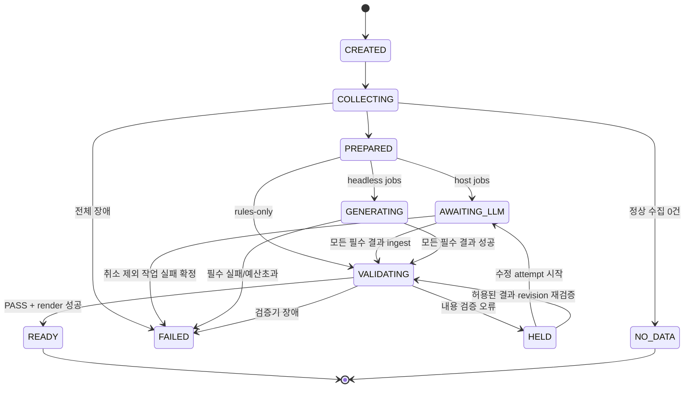

# 02. 데이터·CLI·상태 계약

이 문서는 필드와 의미의 정본이다. `examples/`는 설명용 데이터이며 실제 runtime schema가 아니다. T02에서 schema 파일과 dataclass를 구현한다. 모든 JSON은 UTF-8, schema_version=1, 시간은 offset 포함 RFC3339, 내부 저장 시간은 UTC다.

## 1. 공통 직렬화

- canonical JSON hash: `json.dumps(obj, ensure_ascii=False, sort_keys=True, separators=(',', ':'), allow_nan=False).encode('utf-8')`의 SHA-256 hex.
- 실제 artifact hash: 저장된 파일 **원본 bytes**의 SHA-256. canonical object hash와 artifact bytes hash를 혼동하지 않는다.
- unknown field: 외부 LLM 결과는 `additionalProperties=false`, 내부 schema minor 확장은 reader가 허용한 `extensions` 객체에서만 수용.
- hash 문자열: 64자리 소문자 hex. run_id: `^[0-9]{8}T[0-9]{6}Z-[a-f0-9]{12}$`.
- JSON numbers: NaN/Infinity 불허. importance는 정수 1..5; Python bool을 int로 허용하지 않는다.
- 오류는 `{code,message,retryable,stage,details}`. details는 JSON-safe이고 비밀/전체 prompt 금지.
- 스키마 파일은 bundle 안에서만 참조한다. validator가 네트워크로 remote `$ref`를 가져오지 않는다.

## 2. RunSpec

| 필드 | 타입/필수 | 규칙 |
|---|---|---|
| schema_version | int, 필수 | 1 |
| pipeline | enum, 필수 | market / self |
| mode | enum, 필수 | host / headless |
| llm_enabled | bool, 필수 | 기본 true, --llm off일 때 false(self만 허용) |
| backend | string/null, 필수 | host는 null, headless+LLM이면 claude/codex/hermes/generic |
| force_refresh | bool, 필수 | 기본 false, 해당 run fetch cache 무시 |
| workspace_id | string, 엔진 생성 | canonical workspace 경로 hash 앞 16자리 |
| report_date | YYYY-MM-DD, 필수 | 표시 날짜, 시간창과 구분 |
| timezone | IANA zone, 필수 | 기본 Asia/Seoul; ZoneInfo 검증 |
| window_start/end | RFC3339, 필수 | UTC 저장, start < end |
| hours | integer, 필수 | 1..720, window 차이와 일치 |
| example_mode | bool, 필수 | 기본 false |
| synthesis | object, 필수 | strategy, enrichment, budget |
| delivery_requested | bool, 필수 | 기본 false |
| parent_run_id | string/null | revise/새 실행 계보 |
| schedule_key | string/null | 명시 스케줄 슬롯 키, 동일 workspace에서 UNIQUE |

`synthesis`:

```json
{
  "strategy": "single",
  "enrichment": "off",
  "budget": {
    "max_calls": 3,
    "max_parallel": 1,
    "job_timeout_seconds": 180,
    "run_timeout_seconds": 600,
    "max_input_bytes": 120000,
    "max_output_bytes": 1000000,
    "max_repairs": 1
  }
}
```

`dry_run`은 CLI RunOptions이며 RunSpec에 저장하지 않는다(실행을 생성하지 않기 때문). `--no-email`은 delivery_requested=false로 해석한다. 선택된 role models/effort는 resolved config snapshot에 저장하여 resume 시 환경변수 변화가 기존 run에 유입되지 않게 한다.

`enrichment`: off/optional/required. optional 실패는 warning + keyword fallback; required 실패는 FAILED. strategy: single/split. split은 사용자가 선택하고 예산이 충분할 때만 계획 가능. max_calls는 재시도 포함 **모든 backend 호출의 총량**. max_repairs도 max_calls에 포함.

### 시간 해석

- 날짜 생략: 실행 시작의 now를 cutoff로 고정, 표시 report_date는 timezone의 오늘.
- `--date D`만 제공: 과거일은 D 다음날 00:00 local을 end로 사용(종료점 exclusive); 오늘이면 now. 미래일은 usage error.
- `--as-of <RFC3339>`: 명시 end, report_date는 지정값 또는 local date. `--date`와 모순이면 usage error.
- hours 기본값: 해당 pipeline config; 월요일 보정은 report_date의 weekday를 사용. 현재 시스템 요일을 과거 날짜에 적용하지 않는다.
- 구간은 `[start,end)`. 출처 published_at가 없으면 fetched_at로 조용히 대체하지 않고 timestamp_unknown으로 기록, 기본 포함하되 warning과 별도 집계. 미래 published_at는 제외·진단.

## 3. Article 및 collection report

```json
{
  "id": "a_0123456789abcdef0123456789abcdef",
  "url": "https://example.org/news/1",
  "canonical_url": "https://example.org/news/1",
  "title": "예시 제목",
  "source_name": "Example Journal",
  "published_at": "2026-09-15T00:00:00Z",
  "fetched_at": "2026-09-15T00:05:00Z",
  "language": "ko",
  "body": "추출된 원문",
  "summary": "전처리 요약 또는 빈 문자열",
  "categories": ["battery"],
  "self_mention": false,
  "relevance_score": 4,
  "importance": null,
  "provenance": {"collector":"rss","extractor":"trafilatura","body_sha256":"..."}
}
```

위 hash의 `...`는 이 설명 블록만의 축약이며 실제 schema 예시 파일에는 완전한 값 사용.

ID = `a_` + SHA-256(canonical_url) 앞 32자리. 수집·enrich·aggregate·ref 전 구간에서 하나의 함수 사용. URL 없는 기사는 별도 `u_` + title/source/published tuple hash로 보관하되, 기본 발송 근거 ref로 사용하지 않는다. 실제 충돌 발견 시 조용히 덮어쓰지 않고 ARTICLE_ID_COLLISION.

URL normalization: scheme/host 소문자, fragment 제거, default port 제거, utm_*/gclid/fbclid만 제거. query order의 의미를 임의 제거하거나 path를 소문자로 바꾸지 않는다. redirects 후 최종 URL과 최초 URL 모두 provenance에 보존. Google News URL은 resolver의 최종 URL로 normalize; 실패는 진단.

CollectionReport 필수 필드:

- schema_version, run_id, window_start/end.
- sources: `[{id,status:ok|failed|skipped,returned_count,error:null|Error}]`.
- discovered_count, extracted_count, eligible_count, excluded_count, timestamp_unknown_count.
- all_sources_failed(bool), incomplete(bool), diagnostics(list).

`eligible_count=0`과 `all_sources_failed=true`는 다른 상태다. 전체 provider 실패는 FAILED. 정상 source 1개 이상이나 0건은 NO_DATA. 일부 실패/추출 전량 실패는 아래 validation policy에 따라 HELD 또는 FAILED이며 NO_DATA로 숨기지 않는다.

## 4. LLMRequest

필수: schema_version, run_id, job_id, kind, required, input_hash, instructions, input, output_schema, limits.

- kind: market_brief / market_core / market_category / glossary / article_enrichment / pr_brief.
- job_id: kind 또는 `market_category.<safe-category-id>`; `[a-z0-9._-]{1,100}`.
- input_hash: `{kind,instructions,input,output_schema,limits}`의 canonical hash. request envelope의 run_id/job_id는 hash에 넣지 않지만 결과 envelope에서 별도 검사.
- instructions: host-agnostic prompt. source text와 분리.
- input: article views, required_ref_ids, required_category_ids, self_context, locale.
- output_schema: 로컬 self-contained schema object(URI만 전달하지 않음).
- limits: max_output_bytes, max_repairs. backend 실행 timeout은 engine 정책이며 LLM에게 맡기지 않는다.
- job에 send-email·웹 검색·shell 명령을 지시하지 않는다. 현재 spec의 “formatter 실행해서 고쳐라”는 engine validate/repair로 옮긴다.

기사 보강이 off면 request의 lead/summary는 추출 기반임을 표시한다. LLM 생성 요약을 원문 인용으로 표기하지 않는다. 상대 모델이 싼 모델이라는 이유로 rubric이나 required refs를 생략하지 않는다.

## 5. LLMResult

```json
{
  "schema_version": 1,
  "run_id": "20260915T010000Z-0123456789ab",
  "job_id": "market_brief",
  "input_hash": "64자리 hash",
  "status": "ok",
  "payload": {},
  "error": null
}
```

- status=ok이면 payload는 kind별 schema, error=null.
- status=error이면 payload=null, error는 `{code,message,retryable}`.
- `ingest`는 envelope 및 payload를 모두 검사. 다른 run/job/hash, 부분 JSON, null payload, unknown keys는 거부.
- headless의 process rc가 nonzero라면 파일/JSON이 있어도 성공으로 승격하지 않는다. raw artifact는 진단용 저장.
- 호스트 세션은 process rc가 없으므로 제출된 envelope+현재 pending request+schema/semantic 검증으로 판정한다. origin=host 기록.
- 결과 파일을 쓰다가 중단돼도 파일 존재를 성공으로 보지 않는다.

## 6. MarketBriefPayload v1

필수: `tldr`, `insights`, `category_summary`, `headlines`, `company_glossary`, `landscape_update_points`.

```text
CitedText = { text: nonempty string, refs: unique ArticleID[] }
Insight = {
 id: string,
 title: nonempty string,
 observation: CitedText[],
 implication: [{text:nonempty string, basis_refs:ArticleID[], uncertainty:"inference"|"needs_confirmation"}]
}
CategorySummary = {
 category_id: string,
 paragraphs: CitedText[],
 covered_refs: unique ArticleID[]
}
Headline = {ref: ArticleID, text:nonempty string, category_id:string}
GlossaryEntry = {name:string, desc:string, refs:ArticleID[]}
LandscapePoint = {
 competitor_id:string, dimension:string, text:string,
 refs:ArticleID[], kind:"observation"|"interpretation"
}
```

- tldr: 1..3 CitedText blocks. 각각 refs 최소 1. 자사 해석은 insights.implication에 두고 무근거 TL;DR 문장을 만들지 않는다.
- insights: tier1 >=2이면 기본 최소 1, 최대 5. tier1 <2이면 빈 배열 허용(“통합 해석에 충분한 근거 없음”을 engine diagnostic). 입력에 tier1가 없는데 인사이트 최소 개수를 채우려고 기사 생성 금지.
- category_summary: required_category_ids와 **정확히 같은 집합**, 중복 금지. 단락마다 refs 최소 1, 해당 category에 속한 input ref만 허용.
- headlines: eligible market 기사별 정확히 1개. category 중복 기사도 source ID 하나당 주 분류 1개를 engine이 지정.
- category.covered_refs는 그 category의 required_ref_ids와 일치. 각 covered_ref는 paragraphs.refs 중에도 등장해야 한다. “목록에만 적고 서술 없이 covered”는 불허.
- source URL/name/date는 payload에 받지 않는다. renderer view model에서 canonical ArticleRegistry로 조인.
- glossary 빈 배열 허용. 이름 중복 금지, 근거 없는 background는 추가하지 않음.
- landscape points 빈 배열 허용. refs는 존재해야 하고 competitor/dimension은 config allowlist.
- 단락 refs는 문장의 실제 근거인지 완전히 자동 검증할 수 없다. ref 존재/유형은 강제하고 대표 사례의 편집 검수로 보완.
- 레거시 plain text tldr/summary로 변환 시 deterministic ref anchors를 유지한다. 새 typed payload에는 regex로 회사명 매칭하여 근거를 추측하는 경로를 사용하지 않는다.

### split mode payload

- market_core: tldr, insights, landscape_update_points만.
- market_category: 하나의 CategorySummary + 그 카테고리 headlines.
- glossary: GlossaryEntry[]; optional job.
- merge는 required job 전부의 valid 결과가 있을 때만 한다. dict.update로 서로의 키를 무제한 덮어쓰지 않는다.
- glossary failure는 warning. core/category failure는 FAILED. 부분 미리보기는 HELD watermark와 missing category 안내를 넣어 명시적 `render --allow-held`에서만 생성.

## 7. PR 데이터 계약

LLM 이전 `PRRecord`:

```text
{
 article_id, mention_type:"direct"|"indirect"|"stock",
 rule_tone:"positive"|"neutral"|"negative",
 tone: 같은 enum,
 tone_origin:"rule"|"llm"|"fallback",
 evidence:[{text:string, source_ref:ArticleID}],
 summary:string, author:string|null
}
```

LLM `pr_brief` payload:

```text
{
 narrative: CitedText[],
 annotations:[{
  article_id:ArticleID,
  tone:"positive"|"neutral"|"negative",
  summary:string
 }]
}
```

engine이 title/source/date/URL을 채운다. annotations는 입력 ID만 허용, 중복 거부. rule_tone이 positive/negative로 확정되었으면 LLM이 바꾸지 않는다(기존 정책 보존). 미응답 annotation은 rule fallback + diagnostic; narrative에 unknown refs가 있으면 HELD. `mode=rules`는 RunSpec mode 대신 CLI `--llm off`로 선택하고 생성 요청 없이 통계 서술을 engine이 만들며 “규칙 기반 요약” 표시. 정상 수집 0건이면 NO_DATA이며 LLM 호출 없음.

PRReport artifact = `{schema_version,run_id,records:PRRecord[],narrative:CitedText[],stats}`. stats의 direct/indirect/stock 및 tone 합계는 records에서 engine이 계산한다.

### BriefingDocument envelope

engine이 검증 대상으로 저장하는 파일은 `{schema_version:1,run_id,pipeline,revision,payload}`이다. pipeline=market이면 위 MarketBriefPayload, pipeline=self이면 PRReport의 records/narrative/stats를 payload로 저장한다. LLMResult envelope 자체를 렌더러에 전달하지 않는다. `briefing_hash`는 이 BriefingDocument 파일 bytes의 hash다.

## 8. ValidationReport

```text
{
 schema_version, run_id, revision,
 briefing_hash, policy_hash,
 status:"PASS"|"HELD"|"ERROR",
 findings:[{code,severity:"info"|"warning"|"error",path,message,refs:[]}],
 required_jobs:{expected:int,succeeded:int},
 coverage:{expected:int,covered:int},
 checked_at
}
```

- PASS: error=0, 모든 mandatory validator 실행 성공.
- HELD: 입력은 읽혔으나 completeness/ref/policy error가 존재.
- ERROR: validator 실행 자체 실패/결과 저장 불가. run은 FAILED.
- report 없음/invalid JSON/잘못된 hash면 send는 거부. 빈 finding 배열만으로 PASS 추론 금지.
- validator 결과는 briefing hash+policy hash+renderer 입력 revision에 결합. 정책 변경 후 오래된 PASS 재사용 금지.

| code | 기본 severity | 의미 |
|---|---|---|
| REQUIRED_JOB_FAILED | error | 필수 job 실패 |
| SCHEMA_INVALID | error | 구조/타입 오류 |
| INPUT_HASH_MISMATCH | error | 오래된/다른 입력 |
| UNKNOWN_REF | error | registry에 없는 출처 |
| MISSING_CATEGORY | error | 필수 카테고리 누락 |
| COVERAGE_GAP | error | required 기사 서술/ref 누락 |
| EMPTY_BRIEFING | error | 정상 기사가 있는데 빈 원고 |
| COLLECTION_INCOMPLETE | error | source 부분 장애로 수집 완전성 불명 |
| EXTRACTION_LOW_COVERAGE | error | 적격 URL 중 추출 성공률 < 0.5(정책 기본) |
| SOURCE_TIME_UNKNOWN | warning | 발행시각 불명 |
| ENRICHMENT_SKIPPED | warning | 선택 보강 미실행 |
| GLOSSARY_UNAVAILABLE | warning | 선택 용어집 미생성 |
| STYLE_SENTENCE_LONG | warning | 문장 길이 |
| ASSERTION_PATTERN | warning | 기존 의심 표현 패턴; 진위 판정은 아님 |
| FORBIDDEN_TERM | error | config가 명시 금지한 용어 |
| UNSAFE_OUTPUT | error | HTML/URL 등 출력 제약 위반 |

수집 임계값은 config에서 바꿀 수 있으나 schema/ref/hash/필수 job 검증은 disable할 수 없다. `--force-send` 같은 gate bypass 옵션은 제공하지 않는다. 부족한 데이터를 새로 수집하거나 원고·정책을 수정하고 재검증한다.

## 9. 상태 머신



CANCELLED는 READY/NO_DATA 이외 진행 상태에서 사용자 취소 가능. HELD 수정 시 mode=headless면 GENERATING으로, host면 AWAITING_LLM으로 간다. 도표는 대표 경로이며 transition allowlist 테스트에 두 경우 포함.

- READY는 검증 PASS+artifact hash 등록 완료를 의미. 발송 성공을 뜻하지 않는다.
- render 실패는 FAILED; 기존 READY artifact를 덮어쓰지 않는다.
- FAILED resume은 error.retryable=true인 failed stage부터만 수행. config/input이 바뀌면 새 run.
- job 상태: pending/running/succeeded/failed/skipped. succeeded는 schema+입력검증까지 통과한 상태.
- stage 상태: pending/running/succeeded/failed/skipped + `attempt`, `started_at`, `ended_at`, `input_hash`, `output_hash`.

## 10. Delivery 계약

상태: not_requested / skipped / sending / accepted / failed / unknown. accepted는 provider가 수락했다는 뜻이며 사용자의 받은편지함 도착을 보증하지 않는다.

`dedupe_key = hash(workspace_id,pipeline,logical_window,html_hash,recipient_set_hash,provider,sender)`.

logical_window는 UTC start/end. recipient hash는 주소 trim+domain 소문자+정렬+중복제거 결과. 주소 local part를 임의 소문자로 정규화하지 않는다. Message-ID는 delivery_id에서 한 번 만들고 retry에도 유지.

- 동일 dedupe_key accepted → skip, exit0.
- sending → concurrent attempt 거부.
- unknown → 자동 재시도 금지, `delivery resolve --delivery-id --outcome accepted|not-sent`로 운영자 확인 결과 기록.
- failed: 요청을 전송하기 전에 실패했음이 확실한 경우만 retryable.
- partial SMTP refusal: 수락/거절 recipient 집합을 receipt로 기록, 전체 재전송 금지. 기본 unknown/partial diagnostic으로 운영자 처리.
- sender/auth 값은 도메인 config/env에서 읽지만 raw secrets는 원장에 넣지 않는다.

## 11. CLI 정본

문서에서 `prm`은 `python /absolute/bundle/prmonitor_launch.py`의 약칭이다. `--workspace`, `--cache-dir`, `--json`은 각 subparser의 공통 옵션으로 등록하여 **명령 뒤에** 사용한다. 호환 wrapper는 기존 위치도 가능한 한 받아주되 중복 충돌 시 usage error.

| 명령 | 역할 | 기본 부작용 |
|---|---|---|
| doctor [--backend X] [--live] | 환경·config·deps·경로·CLI probe | --live 없이 LLM/network 없음 |
| init --workspace PATH [--example contoso] | 명시적 설정·runtime 초기화 | 발송 없음 |
| config validate | domainpack schema와 교차 참조 | 쓰기 없음 |
| config migrate [--apply] | legacy 설정을 v1로 변환 | 기본 diff만, apply시 backup |
| run --pipeline market\|self --mode host\|headless | 새 실행 생성+가능한 단계 실행 | 기본 메일 없음 |
| collect --pipeline ... | 수집/추출/분류까지 | 네트워크 있음, LLM 없음 |
| prepare --run-id ID | aggregate/context/job request | 필요한 경우 enrichment request가 먼저 반환 |
| jobs --run-id ID [--next] | pending requests 경로 조회 | 쓰기 없음 |
| jobs skip --run-id ID --job-id J --reason TEXT | optional job 명시 skip | 필수 job에는 거부 |
| jobs repair --run-id ID --job-id J | HELD의 수정 가능한 job을 새 attempt로 열기 | 기존 결과 보존, 새 request 반환 |
| ingest --run-id ID --job-id J --file FILE | 결과 import+validate | 외부 호출 없음 |
| synthesize --run-id ID --backend X | pending jobs CLI 실행 | 예산 내 LLM 호출 |
| validate --run-id ID | 전체 내용 gate | 메일/메모리 없음 |
| render --run-id ID [--allow-held] | HTML/CSV/XLSX | 메일/메모리 없음 |
| resume --run-id ID | 상태에 따라 다음 단계 실행 | 등록된 spec 유지, 자동 메일 없음 |
| revise --run-id ID | READY를 새 child run으로 복사 | 새 실행, 이전 불변 |
| send --run-id ID --group G | gate 확인+전송 | 명시적 발송 |
| delivery resolve ... | unknown 전송의 운영자 확인 기록 | 재전송 자체는 하지 않음 |
| memory promote --run-id ID | 적격 observation 적용 | interpretation 후보는 별도 명시 승인 |
| status --run-id ID | DB 정본 상태+artifact 경로 | 없음 |
| gc [--apply] | 보존 대상/삭제 예상 목록 | 기본 preview |
| paths | resolved roots 표시 | 없음 |

`run` options: `--hours N`, `--date D`, `--as-of TS`, `--backend X`, `--strategy single|split`, `--enrichment off|optional|required`, `--llm off|on`, `--dry-run`, `--no-email`, `--send`, `--force-refresh`, `--schedule-key KEY`.

- dry-run: config/plan validation만, collection/LLM/email/메모리/runtime install 없음. 진단은 stdout/stderr만, run도 DB에 생성하지 않는다.
- no-email: 모든 wrapper에 전달되는 최우선 금지. send와 동시 지정 시 usage error. canonical run은 원래 no-email가 기본이며 명시 flag는 legacy wrapper 보호용.
- send: READY 이후 전송 요구. pipeline config `send_email:false`면 SKIPPED; true는 허용 조건이지 자동 요구가 아니다. 요청 수신 group 없어도 발송 시도 금지.
- init --force는 legacy 초기화 opt-in 의미만 유지하고 설정 덮어쓰기 의미로 바꾸지 않는다.
- `pre`,`post`,`market-brief`,`newsletter`,`self-brief`,`self-brief-daily`,`pr-*` alias는 T10 호환 표를 따른다. 기존 self-brief(pre 필요)와 새 run --pipeline self(전체 실행)를 조용히 같은 동작으로 치환하지 않는다.

### exit code / stdout

| 코드 | 의미 |
|---|---|
| 0 | 요청한 단계 완료; AWAITING_LLM/NO_DATA/전송 skip 포함 |
| 1 | 예기치 않은 프로그램 오류 |
| 2 | CLI/config 사용 오류 |
| 10 | HELD, 내용 검토 필요 |
| 20 | 의존성/필수 실행 실패 |
| 21 | deadline/호출 예산 초과 |
| 30 | 전송 실패 또는 unknown |
| 40 | 동시 작업 충돌/lease 보유 |

`--json` stdout에는 JSON 객체 **정확히 하나**. 모든 진행 print와 하위 script stdout은 포착하여 stderr로 옮긴다. JSON envelope 필수: schema_version, command, run_id(null 허용), state, exit_code, artifacts, next_actions, error(null 허용), diagnostics.

`next_actions`는 `{command,argv:list[str],reason}`. argv는 launcher 뒤에 붙일 인자 목록이고 shell command가 아니다. 셸 문자열이나 eval 입력을 만들지 않는다. next_actions에 send를 자동 실행 지시로 포함하지 않는다; 명시적 delivery_requested인 경우에만 안내 가능.

## 12. 설정

`config/runtime.yaml`:

```yaml
schema_version: 1
timezone: Asia/Seoul
llm:
  backend: null
  strategy: single
  enrichment: off
  models:
    synthesis: null
    enrichment: null
    glossary: null
    pr: null
  effort: low
  max_calls: 3
  max_parallel: 1
  job_timeout_seconds: 180
  run_timeout_seconds: 600
  max_input_bytes: 120000
  max_output_bytes: 1000000
  max_repairs: 1
validation:
  min_extraction_ratio: 0.5
  hold_on_partial_collection: true
retention:
  cache_days: 7
  generated_days: 30
  audit_days: 90
  keep_delivery_ledger: true
```

model=null은 backend 자체 기본값, 모델 옵션 생략. Claude frontmatter default는 legacy wrapper에서만 migrate 힌트로 읽는다. 모든 role의 우선순위: 명시 role CLI(있는 경우) → PRM_*_MODEL → runtime.llm.models[role] → null. PRM_HAIKU_MODEL→pr tone, PRM_SONNET_MODEL→pr narrative alias는 deprecation notice. 모델 정책에서 이름에 opus가 있다는 이유로 다른 backend 모델을 자동 치환하지 않는다.

새 config-templates/defaults는 산업 무관 설정만 가진다. company-profile/categories/pr-queries/keywords/sources는 operational mode에서 사용자 파일 필수. 예시는 init --example contoso에서만 복사하고 workspace.example_mode=true로 표시. 예시 모드에서는 send를 금지한다.
