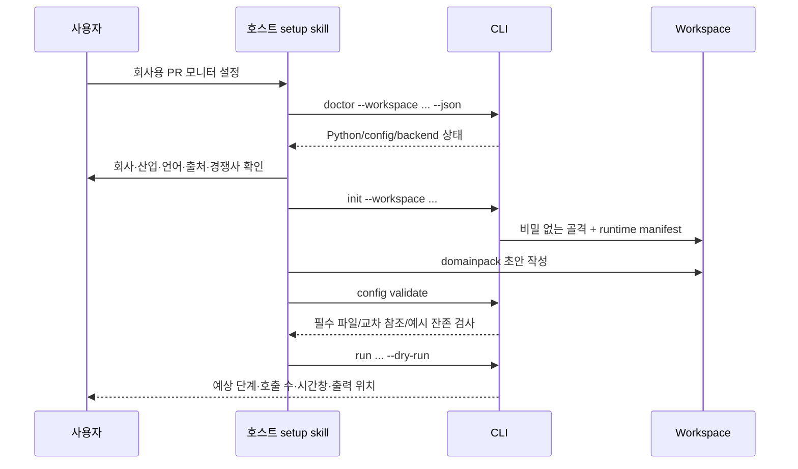
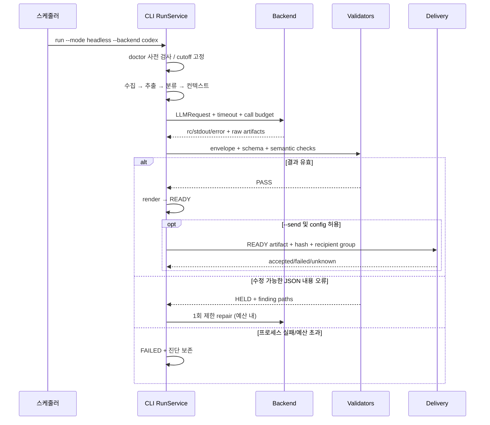

# 03. 실행 워크플로와 장애 처리

모든 명령은 목표 CLI다. 지금 바로 사용할 수 있는 명령으로 오해하지 않도록 구현 전 README에는 노출하지 않는다.

## W01. 최초 설치 / 기존 설정 가져오기



- SessionStart는 이미 opt-in한 workspace의 가벼운 doctor만 한다. import/module load 때 pip 설치하지 않는다.
- 명시 init에서만 deps install 허용. 실패하면 config scaffold는 보존하되 `runtime_ready=false`, exit20. “초기화 완료”로 표시하지 않는다.
- 기존 `.prmonitor-initialized`는 이전 opt-in 증거로 읽되 새 runtime ready의 증거로 쓰지 않는다.
- 기존 config의 custom 값을 overwrite하지 않는다. migration dry-run은 key별 before/after와 file list. apply는 timestamp backup과 변경 hash를 남긴다.
- 이메일은 별도 setup delivery 섹션. 생성 기능을 사용하려고 메일 인증이 필수인 흐름 금지.
- 스킬의 기존 setup-bootstrap 연구 단계는 재사용하되 host-neutral prompt로 옮긴다. 외부 검색 capability가 없으면 입력 템플릿을 제공하고 미확인 facts를 생성하지 않는다.
- 기본 뉴스 source connectivity test는 `doctor --live`에서만. `doctor`가 기사 수집이나 LLM 호출 비용을 만들지 않는다.

## W02. 대화형 마켓 브리핑 — 현재 호스트 LLM

```text
run --pipeline market --mode host --workspace W --json
→ run 생성, collect/extract/classify
→ enrichment=off: aggregate/context 생성
→ pending market_brief request 반환, state=AWAITING_LLM
→ 호스트가 request를 읽고 payload JSON 작성
→ ingest --run-id R --job-id market_brief --file result.json --json
→ validate --run-id R --json
→ render --run-id R --json
→ READY artifact 링크를 사용자에게 전달
```

`ingest`는 결과 등록까지이며 자동 render/send/memory를 하지 않는다. `validate`는 PASS일 때 render 전 PREPARED 상태를 새로 만들지 않고 state=VALIDATING을 유지한다. `render`가 PASS report와 artifact를 함께 확정하여 READY로 바꾼다. `status`는 phase=validated를 diagnostics로 보여준다. Headless `run`/`resume`는 이 명령들의 service 함수를 순서대로 호출한다.

호스트가 알아야 할 내용은 request + pending job schema + 반환 path뿐이다. run_id/input_hash를 바꾸지 않는다. LLM 자신이 validation report의 PASS를 작성하는 것을 허용하지 않는다.

### 선택적 enrichment=optional|required

1. collect/classify 뒤 article_enrichment request만 먼저 만든다.
2. host가 enrichment 제출 또는 optional job을 명시 skip한다(`jobs skip --run-id R --job-id article_enrichment --reason ...`, 이 명령을 T05에서 구현).
3. `prepare --run-id R`를 다시 실행하면 보강 결과 적용 → aggregate/context → market request.
4. engine은 단계 input hash에 enrichment 결과/skip 이유를 포함.
5. 보강 request에 전체 본문을 넣지 않고 title+lead만 사용한다. clipped 여부 기록.

run이 AWAITING_LLM인 동안 프로세스는 종료된다. daemon/폴링 세션이 필요 없다. resume할 때 기존 context가 유효하면 추가 수집을 하지 않는다.

## W03. 무인 마켓 브리핑



- expensive collection 전 backend usable 여부 확인. 단 file 존재뿐 아니라 CLI version/help/readiness를 분리 확인.
- automatic retry: 일시 네트워크/429/5xx 등 backend가 확실하게 transient로 분류한 경우만 1회. 2초+작은 jitter, 남은 deadline 확인.
- malformed payload는 retry와 다른 repair: 1회, 원본 request+invalid payload+finding path만. 전체 수집 재실행 금지.
- auth 없음/unsupported flag/model unknown/input mismatch/schema incompatibility는 무작정 재시도하지 않는다.
- max_calls=3이면 최초1+transient retry1+repair1까지. enrichment on이면 최초 보강 호출도 포함하므로 남은 예산을 먼저 계산한다.
- split plan에서 필수 job 수가 max_calls보다 크면 시작 전에 usage error. max_parallel 설정을 읽되 실제 process가 제한을 넘지 않게 executor 한 곳에서 관리한다.
- timeout은 monotonic clock의 deadline. subprocess timeout뿐 아니라 pipe read/child descendants 정리 포함.
- 종료 전 필수 작업 실패가 있으면 final briefing을 쓰지 않는다. 일부 JSON이 있어도 진단 artifact로만 남긴다.

## W04. 자사 PR 브리핑

현재는 market 전처리 전체를 하고 PR renderer가 다시 수집한다. 새 경로는 self query scope로 **한 번** 수집한다.

```text
run --pipeline self --mode host/headless
  1. self aliases/query에 해당하는 URL 수집
  2. 원문 추출 및 자사 언급 확인
  3. title/body 기반 직접·간접·stock 분류
  4. 규칙 tone/evidence/author 정규화
  5. PRRecord[] 생성
  6. pr_brief job 1개로 narrative+annotations (또는 --llm off)
  7. annotation join + 규칙 tone 우선 적용
  8. schema/ref/record-count/HTML 안전성 검증
  9. HTML + CSV + XLSX 동일 records로 생성
 10. READY 이후 월별 뷰/관찰 후보 생성
 11. 명시 --send이면 전송 service
```

- PR renderer는 fetch_missing_bodies나 get_backend를 import하지 않는다.
- stock은 제목에 자사 직접 언급된 경우만 포함하는 기존 규칙을 유지한다.
- summary/evidence에 본문이 없으면 snippet fallback을 쓰되 provenance=snippet 표시. 근거 없음은 null/diagnostic; LLM이 인용문 생성 금지.
- CSV 행 수는 `csv.DictReader`의 레코드 수. 본문 줄바꿈 때문에 수치가 증가하지 않는다.
- XLSX와 HTML tone/stats가 같은 records에서 나와야 한다. formatter마다 독립 재분류 금지.
- zero articles는 NO_DATA; “0건 안내 HTML”은 생성 가능하지만 정상 뉴스레터와 구분하고 기본 미발송.

## W05. 검증 보류 / 수정

1. HELD이면 `data/output/<pipeline>/<run_id>/REVIEW_NEEDED.md`에 finding code/path/refs와 수정 방법을 작성.
2. preview 요청 시 `render --allow-held`는 HELD 라벨과 누락 정보를 표시한다. READY artifact record로 등록하지 않는다.
3. `jobs repair` 또는 result 재제출로 새 attempt 작성. 수정을 허용한 job은 명시적으로 pending으로 되돌린다.
4. `ingest`가 revision 증가, 이전 validation/render record는 과거 기록으로 보존하되 active로 사용하지 않는다.
5. validate→render 다시 수행. PASS가 되면 현재 run의 review 파일은 archive하고 active review 제거.
6. 다른 run의 REVIEW_NEEDED는 지우지 않는다. 전역 REVIEW_NEEDED.md 하나를 공유하지 않는다.

필수 job 실패로 FAILED면 수동 편집만으로 PASS 변경 금지. retryable stage resume 또는 새 run. unsupported CLI flag부터 고치고 동일 request로 retry 가능.

## W06. 발송 / 중복 방지 / 불명확한 결과

전송 직전 체크 순서:

1. run READY, example_mode=false.
2. latest ValidationReport PASS, briefing/policy/HTML hash 일치.
3. no-email=false, explicit request 존재, pipeline.send_email≠false.
4. group이 존재하고 주소가 유효. recipients 없는 빈 이메일 금지.
5. dedupe_key 계산, DB transaction으로 sending row 예약.
6. transaction 종료 후 transport 실행.
7. provider 수락 → accepted. 연결 전 failure → failed. 응답 유실/partial 수락 → unknown.
8. receipt와 DB 상태 저장. 저장 실패 시 프로세스 종료, 다음 시도에서 sending lease 만료를 unknown으로 변환.

SMTP의 Message-ID는 중복 감소 힌트일 뿐 수신 서버 dedupe 보장이 아니다. accepted를 사용자가 아직 못 받았다고 해서 engine이 자동 재전송하지 않는다. 명시적인 새 발송은 사유 기록 및 새로운 delivery attempt의 범위를 정해야 한다.

`send_html_email` legacy bool wrapper는 service의 결과를 bool로 축약하는 한시적 adapter만 유지. 최종 UI/JSON은 delivery.status를 반드시 노출한다. 콘텐츠 생성 성공·전송 실패를 하나의 성공으로 표현하지 않는다.

## W07. self-context와 월별 누적

- 매번 source ID + event type + normalized observation + source date로 event hash 생성.
- 정상 READY PR record는 observations ledger에 idempotent append.
- headline 요약은 `reported_observation`으로 저장하며 회사 사실 자체가 확정되었다고 승격하지 않는다.
- market landscape points는 refs valid + kind=observation + allowlisted competitor/dimension일 때만 자동 적용 가능.
- interpretation/전략 제안은 candidates에 저장, 사람이 명시 promote할 때 baseline과 별개 레이어에 추가.
- `company-narrative.md`, 기존 baseline/themes/self_implications는 자동 overwrite하지 않는다.
- 월별 CSV/XLSX는 accepted records를 source로 재생성 가능한 view. 불완전 파일에 append를 반복하지 않는다.
- apply는 memory_events unique key 예약 후 파일 쓰기/DB applied; crash 재실행 시 hash로 idempotent. derived view는 DB/event records에서 다시 만들 수 있어야 한다.
- NO_DATA/HELD/FAILED는 관찰 승격 없음. 메일이 skipped라도 READY의 관찰은 적격.

## W08. 업데이트와 롤백

1. bundle 새 버전을 설치. 사용자 workspace/cache 경로는 유지.
2. 요구 Python/deps hash가 달라지면 새로운 runtime dir을 만들고 검증 후 사용.
3. config migration은 dry-run plan부터; init으로 덮어쓰지 않는다.
4. DB schema migration 전 backup. 이전 버전이 새 DB를 읽을 수 없으면 downgrade 명시 오류.
5. rollback은 기존 bundle/runtime를 다시 선택하고 필요 시 backup DB+workspace snapshot 복원. 최신 발송 receipt를 버리는 DB rollback은 중복 위험이 있으므로 ledger를 따로 보존하고 운영자 판단 필요.
6. 성공한 과거 output은 그대로 링크 가능. 새 renderer로 보려면 revise/new render copy.

## W09. 스케줄

스케줄의 소유자는 호스트/OS다. engine 안에 cron daemon을 만들지 않는다.

- host-native schedule: 같은 skill의 `run --mode host` workflow를 수행할 수 있는지 실제 host capability 확인.
- OS schedule: `run --mode headless --backend ... --workspace ...`.
- credential이 있는 로컬 OS 실행과 클라우드 실행을 같은 것으로 안내하지 않는다.
- run args는 절대경로, 실행 timezone, PATH/runtime를 명시.
- 동일 logical scheduled slot을 두 번 실행하면 engine에 `--schedule-key <opaque-id>`를 전달하도록 T10에서 옵션 추가. runs 테이블에 schedule_key nullable UNIQUE, spec_json에도 보존.
- schedule_key는 scheduler_id+scheduled_at+pipeline의 hash. 수동 실행은 null. 같은 키로 다시 호출 시 기존 run status 반환/resume만 허용.
- missed schedule은 기본 한 번 catch-up, 반복 밀린 run을 전부 자동 발송하지 않는다. catch-up 정책은 문서화된 scheduler 설정.
- 사용자의 기존 schedule을 자동 삭제/이전하지 않는다. setup이 구체적인 변경안을 보여주고 사용자가 선택한 항목만 변경한다.

## W10. 공개 샘플 / Pages

- `scripts/demo/build_samples.py`는 고정 fixture → 실제 renderer를 계속 사용.
- production `RunSpec(example_mode=true)` fixture builder로 전환하되 네트워크/LLM/메일 없이 생성.
- market sample source IDs도 새 registry 계약 적용; 상대 URL은 example mode에서만 허용.
- 생성 timestamp는 고정 fixture 날짜로 normalize하여 재생성 diff가 내용 변화만 나타내게 한다.
- 공개 파일은 docs/demo allowlist. `.prmonitor`, config, cache, logs, audit evidence 업로드 금지.
- `.github/workflows/pages.yml`은 정적 artifact만 upload. host auth가 없는 Actions에서 실제 뉴스 수집·합성은 실행하지 않는다.
- sample 재생성/검증을 CI에서 수행하되 deploy는 사용자 설정된 main push workflow를 유지.
