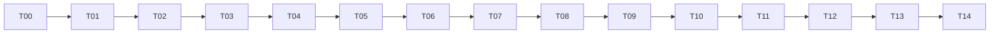

# 04. 구현 티켓과 파일별 변경 지시

## 진행 원칙

- 한 번에 한 티켓. 한 티켓이 세션 컨텍스트를 넘으면 `.a/.b`로 나누고 STATUS에 남긴다.
- 기존 동작을 이동할 때 한 파일 삭제 후 대량 재작성보다 pure helper 추출 → wrapper 교체 순서를 따른다.
- 티켓 완료마다 `git diff --check`, 명시 테스트, STATUS와 작업 기록을 갱신한다.
- 커밋/배포 권한은 새 세션의 사용자 요청을 따른다. 기본은 로컬 구현·테스트까지; 계획만을 근거로 실메일/공개 배포를 실행하지 않는다.
- 줄 번호는 변경될 수 있으므로 아래 함수명과 심볼로 찾는다.

## 의존 DAG



순차 진행을 기본으로 고정했다. 일부 작업은 이론적으로 독립적이지만 저비용 모델의 통합 실수를 줄이기 위해 병렬 구현을 요구하지 않는다. T11의 Hermes live 장애는 mock/interface 구현 후 T12~T13 작업을 막지 않지만 T14의 Hermes release gate는 막는다.

## T00 — 기준선과 계획 정합성 확인

**읽기:** README, 00, 감사 REPORT, STATUS.

**작업:**

1. pwd, git status, commit 확인. 사용자 변경은 보존.
2. requirements-dev 환경 준비 상태 확인. 기존 테스트 전체 실행.
3. 감사 reproduce.py를 temp workspace에서 실행해 실패 특성을 다시 확인.
4. 현재 backend version/help를 evidence에 저장. 인증정보 출력 금지.
5. docs/demo의 기존 링크/6건/레이아웃을 기준 fixture로 기록.

**변경 파일:** 진행 기록만. 제품 코드 변경 금지.

**완료:** 기준 테스트 수/결과와 재현 결과가 기록됨. 차이가 있으면 spec을 무작정 적용하지 않고 이미 수정된 부분을 기록.

**검증:** V00. **다음:** T01.

## T01 — 즉시 필요한 안전성·호환성 수정

**읽기:** 00 F01–F08, 05 V01–V08. 아직 전체 구조를 바꾸지 않는다.

**대상 함수:**

- `market_brief._run_parallel_synth`: _run_one 결과를 수집하고 required core/category 중 실패가 있으면 final merge 파일을 만들지 않고 명시 예외. JSON 파싱·최소 타입 검사도 required success에 포함. invalid JSON 파일 존재를 success로 반환하지 않음.
- `market_brief.run`: 직전 파일 삭제만으로 성공을 판단하지 않고 호출 결과/필수 outputs validation. 실패는 nonzero.
- glossary_model: backend-aware default; Claude 외 null/빈 model.
- `llm_adapter.CodexBackend._argv`: 현재 도움말 호환 argv로 수정. 이 단계는 기본 명령 실패를 없애고 T04에서 정식 protocol로 대체.
- `_build_argv`: tokenize before substitution; unknown placeholder에 설명 가능한 RuntimeError, temp file cleanup은 run/run_text scope로 이동.
- `pre.run`: hours 확대 시 synthesis-context/enrich intermediate 포함 downstream 무효화. 기존 파일을 지우는 정책은 임시이며 T03 exact-cache로 대체.
- `post.run`: resolver rc!=0 보류, warning file missing/invalid 보류. 검증 여부 확인 전 memory 갱신 금지.
- `__main__.build_parser`: --no-email/--dry-run 등록, canonical/aliases 모두 전달.
- `self_brief.run`, `self_brief_daily.run`: no_email 전파 및 pipeline.send_email=false 준수.
- `market_brief.run`: dry-run short-circuit를 pre 이전으로 이동. public plan-only semantics의 첫 구현.

**신규 테스트:** `tests/test_pipeline_failures.py`, `tests/test_llm_adapter.py`; 기존 tests/test_format의 “empty 허용”은 renderer의 표현 허용 테스트로 유지 가능하나 pipeline gate는 별도 EMPTY_BRIEFING 거부 테스트.

**완료:** F01–F08 회귀 중 실제 구현 범위 모두 pass. 실패 시 이메일 mock 호출 0. 제품 이미지/본문 스타일 변경 없음.

**비목표:** SQLite, 새 CLI 전면 교체, backend live login 복구.

## T02 — 모델·schema·경로·RunStore 기반

**읽기:** 01 §3–7, 02 §1–3/8–9/12, examples.

**신규:** models.py, errors.py, contracts/, storage/database.py, storage/runs.py, storage/artifacts.py.

**수정:** paths.py, domainpack.py, common.py, tests/test_prmonitor.py.

**순서:**

1. dataclass/enums 정의, schema files 작성, examples를 schema fixtures로 복사.
2. PathContext injection. explicit workspace와 별도 cache. legacy global은 shim.
3. DomainPackSnapshot: resolved values+origin file list+hash. operational config 필수 검증, example fallback 명시.
4. SQLite migrations 및 CAS transition; schedule_key/parent_run_id도 schema에 반영.
5. ArtifactStore atomic write/read hash/containment.
6. manifest projection와 doctor용 integrity reader.

**API 구체화:**

```text
resolve_paths(cli_options, env, cwd, bundle) -> PathContext
load_domainpack(paths, example_mode=False) -> DomainPackSnapshot
RunStore.create(spec, config_hash) -> RunRecord
RunStore.transition(run_id, expected_revision, expected_states, target_state)
ArtifactStore.write_json(run_id, logical_name, revision, obj) -> ArtifactRecord
ArtifactStore.read_verified(record) -> bytes
```

**완료:** 한 프로세스에서 workspace A/B를 번갈아 읽어도 혼합 없음. read-only bundle에 쓰기 없음. manifest 손상을 DB로 복원. crash orphan 불신. 테스트 V09–V16.

**주의:** 기존 `from prmonitor.paths import CONSTANT`의 복사된 global은 런타임 workspace 변경으로 갱신되지 않는다. wrapper별 subprocess 격리를 과도기 해법으로 쓰되 새 service는 전부 ctx 전달.

## T03 — 수집 파이프라인 추출과 캐시

**읽기:** 01 §8, 02 Article/시간, 03 W04.

**신규:** pipelines/articles.py, pipelines/classify.py, pipelines/aggregate.py, pipelines/context.py, services/collection.py, storage/cache.py.

**이동 대상:** scripts/pipeline/fetch-urls.py, batch-extract.py, classify.py, aggregate.py, preload-synthesis-context.py; lib/rss_fetch/gnews_resolver의 network helper는 재사용.

**순서:**

1. canonical ID/URL helper 생성; enrich의 `_aid`와 aggregate의 article_id를 같은 함수로 교체.
2. fetch/extract 결과에 source error diagnostics와 UTC window 부착.
3. classifier/aggregator의 domain rules를 바꾸지 않고 명시 input→output 함수로 추출.
4. context builder는 ArticleRegistry와 self_context snapshot을 받아 immutable JSON 반환.
5. exact-key stage cache 구현, config/self-context/processor version 의존 포함.
6. scripts는 입력 파일 명시 옵션을 받아 library 호출하는 wrapper로 축소.
7. self pipeline collection scope 분리. market pre 전체 실행 후 renderer 재수집 제거 준비.

**완료:** 24→72 확대 및 같은 날 나중 cutoff에서 새 context 생성. 같은 exact key는 재사용. 손상 cache는 rebuild. 전체 source failure와 진짜 0건 구분. V17–V23.

**비목표:** 뉴스 ranking 개선, 새로운 scraping SaaS 추가, semantic embeddings.

## T04 — 프로세스와 backend 계약

**읽기:** 02 §4–5/12, 03 W03, 06 host probes.

**신규:** llm/base.py, process.py, claude.py, codex.py, generic.py, hermes.py, models.py.

**이동:** steps/llm_adapter.py → 새 backend를 호출하는 compatibility shim.

**Protocol:**

```text
Backend.probe(live=False) -> BackendHealth
Backend.build_invocation(request, options) -> Invocation(argv,stdin,cwd,env_delta)
Backend.execute(request, options, deadline) -> BackendResult
BackendResult = process_rc, stdout_json_or_text, stderr_path, duration_ms,
                error, model_requested, model_reported, usage_nullable
```

**실행 구현:**

- Popen + communicate timeout/byte limit; POSIX process group 생성·TERM grace 3초 후 KILL. Windows child tree termination 전략을 검증하고 불완전하면 Windows headless unsupported.
- request는 stdin 기본. 고정된 하나의 JSON response, backtick 제거는 transport별 허용된 wrapper만 처리. 임의 “첫 {부터 마지막 }”로 잘라 통과시키지 않음.
- 사용자 generic template은 argv 배열 JSON을 새 권장 형식으로 제공. 기존 string은 shlex로 먼저 토큰화하는 legacy parser.
- 모델 role별 resolution centralize; 소문자 opus substring 자동강등 제거.
- `probe --help`와 인증 probe를 분리. `shutil.which` true만으로 healthy 표시 금지.
- temp prompt 파일은 TemporaryDirectory 안, success/fail/timeout 모두 cleanup.
- text_mode는 tools disabled의 작업 의미. Codex/Claude의 whole-agent writable mode로 실행하지 않음.

**완료:** fake CLI fixtures로 stdout/JSON/exit/timeout/child cleanup/space·quote·한글 모두 검사. V24–V31. 실제 Hermes probe 미검증이면 explicit unsupported health.

## T05 — JobPlanner와 host/headless orchestration

**읽기:** 02 §4–7/9, 03 W02–W03/W05.

**신규:** services/jobs.py, services/runs.py. 순수 prompts를 prompts/로 이동.

**변경:** market_brief는 service wrapper. 기존 agents markdown의 host 문법과 실행 명령은 adapter로 이동.

**순서:**

1. single request builder, required_refs/categories deterministic 계산.
2. optional enrichment 2-phase prepare, jobs skip 구현.
3. ingest envelope/hash/schema validation과 immutable attempt 기록.
4. headless budget/deadline orchestration.
5. repair request builder; schema error path를 원래 request와 함께 전달.
6. split planner/merge: required job 전부 검증, optional glossary 실패 구분.
7. resume의 성공 job 재사용과 invalidation 검사.

**완료:** host 모드에서 backend subprocess 호출 0. headless single default, N+2 legacy 분할 자동 실행 없음. max_calls 초과 호출 0. 수정 결과는 해당 run/job에만 적용. V32–V39.

**주의:** host 결과 수신 전까지 busy waiting 하지 않는다. CLI는 next_actions와 exit0로 종료한다.

## T06 — 품질 게이트와 뉴스레터 렌더

**읽기:** 02 §6/8, 03 W05/W06.

**신규:** validation/schema.py, briefing.py, quality.py, policy.py; renderers/newsletter.py, legacy.py.

**기존 함수:** format.py의 normalize_fact/build_html/attach_inline_refs/validate_briefing_quality/render_sources; resolve-refs.py.

**순서:**

1. mandatory schema/ref/coverage validators 구현. validator crash는 ERROR.
2. 기존 style warnings를 finding code로 매핑. 메시지 substring으로 길이 warning을 제외하는 코드 제거.
3. typed CitedText → exact registry refs로 HTML anchor 생성. 동일 문장의 번호를 제목 유사도 알고리즘으로 재추측하지 않음.
4. renderer는 view model만 받음. zero/error/held 상태 배너 명시.
5. report의 모든 입력 hash를 validation에 묶고 render artifact 등록.
6. unsafe URL/HTML escape, source label fallback 유지.
7. post wrapper에서 gate 실패 시 메일/기억 side effects 0.

**완료:** 모든 합성 실패/unknown ref/빈 원고/잘못된 warning 파일/partial category는 전달 불가. 긴 문장 warning 하나는 다른 error 없으면 PASS. V40–V49.

## T07 — PR renderer 분해와 canonical self workflow

**읽기:** 02 §7, 03 W04.

**신규:** pipelines/pr.py, renderers/pr.py, renderers/exports.py.

**대상:** scripts/pr/render_pr_clipping.py의 fetch/main/tone/narrative/export 혼합 함수, steps/self_brief*.py.

**순서:**

1. Article→PRRecord 분류 함수 추출, 기존 규칙 regression fixture 고정.
2. pr_brief request 및 annotation application.
3. pure render_pr_html(report,config) / export_csv(records) / export_xlsx(records).
4. source scope 한 번 수집 연결; “extracted file 존재”만의 precondition을 RunStore stage로 대체.
5. newline CSV count 수정, formula-safe export, HTML narrative escape.
6. rules-only 명시 모드와 normal NO_DATA 처리.
7. compatibility wrappers에 no_email/dry_run/정확 hours 전달.

**완료:** import-only side effects 없음. renderer 테스트에서 network/backend monkeypatch 자체가 필요 없는 구조. HTML/CSV/XLSX 통계 동일. V50–V57.

## T08 — 발송 원장과 self-context provenance

**읽기:** 01 §6–7/9, 02 §10, 03 W06–W07.

**신규:** services/delivery.py, delivery/smtp.py, delivery/microsoft_graph.py, services/memory.py.

**이동:** scripts/send-email.py provider 로직, accumulate-pr.py, accumulate-self-context.py, update-landscape.py.

**순서:**

1. send service precondition hash checks.
2. DB reservation/dedupe + Message-ID + result states.
3. provider return model: accepted/rejected/unknown/partial, retryability.
4. secret redaction와 recipient hash.
5. memory observation/candidate split, stable event ID.
6. 기존 baseline merge preserving + 월별 derived view rebuild.
7. 운영 unknown resolve command. 자동 retry 없는 경우 안내.

**완료:** concurrent same send 한 요청만 transport 진입. response-lost는 unknown 후 자동 전송 0. held memory 변경 0. V58–V67.

## T09 — 설치·doctor·설정 마이그레이션

**읽기:** 01 §5, 02 §12, 03 W01/W08.

**수정:** bootstrap.py, steps/init.py, domainpack.py, config templates, setup guide.

**신규:** services/setup.py, doctor.py, config migrations.

**순서:**

1. Python >=3.11 체크 + venv fingerprint(implementation/version/platform/requirements hash).
2. 새 env 생성→실제 requirements import check→ready marker. 실패 env는 active로 전환하지 않음.
3. doctor structured checks: python, dependency env, bundle read-only, workspace writable, config, schema, backend binary/help/auth-known, delivery-configured boolean.
4. operational required files와 defaults/Contoso examples 분리.
5. marker/config migration, backup, dry-run.
6. SessionStart fast path. 프로세스마다 pip나 network 호출 금지.
7. user secrets env/keychain 안내는 호스트가 실제 지원하는 경로만 사용.

**완료:** init 실패 exit20, config 보존, 재시도 성공. 다른 회사 설정의 예시 fallback 없음. deps 변경하면 새 env 반영. V68–V74.

## T10 — 공개 CLI·호환성·스케줄

**읽기:** 02 CLI, 03 W09, 06 compatibility.

**대상:** __main__.py, prmonitor_launch.py, steps wrappers, commands, routines.

**순서:**

1. canonical subcommands/service binding + --json 단일 객체 출력.
2. jobs skip/repair, delivery resolve, memory promote, revise/gc 포함.
3. --schedule-key storage uniqueness, same-slot resume.
4. aliases mapping. date-only legacy input은 해당 날짜의 run을 명확히 resolve; 둘 이상이면 ambiguous error, 최신 임의선택 금지.
5. legacy pre→post 조합이 run_id를 전달하도록 출력/설명 정리.
6. no-email/send/allowed config precedence.
7. routine templates는 absolute path+workspace+timezone+mode 명시.

**완료:** subprocess CLI contract 테스트 pass. config 오류가 있어도 stdout JSON은 유효. deprecated alias가 문서화된 동작. V75–V81.

## T11 — Claude·Codex·Hermes 플러그인 패키징

**읽기:** 06 전부, 03 W01–W03.

**신규:** adapters/*, scripts/packaging/build.py, skills/pr-monitor·market-brief·pr-setup.

**순서:**

1. 공통 skill workflow 작성; 호스트 변수는 adapter template에서만.
2. manifest template을 현재 공식 parser/example로 검증.
3. 단일 engine를 staging artifact 안에 복사, allowlist bundle 검사.
4. Claude commands/hook bridge, Codex .codex-plugin, Hermes native register_skill.
5. build target별 root/skills/entrypoint 자동 검사.
6. 호스트 install dry-run 및 loader validate(가능한 환경).
7. 실제 설치 위치가 repo 밖이고 read-only인 통합시험.

**완료:** 세 artifact 모두 same core hash, host-specific commands만 차이. dependencies-only import가 pip install을 유발하지 않음. V82–V88. Hermes environment unavailable은 host-blocked로 명시.

## T12 — 공개 샘플·Pages 회귀 검증

**읽기:** 03 W10, 06 Pages.

**수정:** scripts/demo/build_samples.py, docs/demo, .github/workflows/pages.yml.

**순서:**

1. fixture를 새 contracts로 이동. Production renderer를 실제 사용.
2. builder의 unittest.mock patch 의존 제거. FixtureCollector/FixtureLLM 결과를 service에 주입하거나 validated view model 직접 렌더.
3. sample mode labels, source links, deterministic timestamps.
4. 390px/desktop viewport, source anchors, accessible link names 검사.
5. build twice → artifact hashes 동일. site allowlist 검사.
6. main 배포 workflow는 유지하되 코드 변경만으로 private artifact를 upload하지 않음.

**완료:** 공개 sample에서 두 보고서가 정상 렌더, 모든 source link labels 있음. V89–V94. 기존 공개 URL 유지.

## T13 — CI·문서·운영 가이드 통합

**읽기:** 05 전부, README/USAGE/routines.

**작업:**

- offline unit/integration CI, macOS/Linux(필수), Windows(지원 주장용 gate) 설정.
- 네트워크 fixture server/fake CLI 사용; 일반 CI에 실제 LLM/email credential 요구 금지.
- codegraph 구조 report 선택 workflow; runtime 의존성에 추가 금지.
- README/USAGE를 최종 CLI/설정/지원 플랫폼으로 다시 작성. 과거 “pre는 LLM 없음” 등의 부정확한 설명 수정.
- release checklist, migration/rollback/unknown-delivery runbook 작성.
- 문서 전체에서 폐기된 bash 경로와 Claude-only variable이 공통 skill에 남았는지 검사.

**완료:** CI green, offline end-to-end PASS/HELD/FAILED 시나리오, T14 live gates를 제외한 전 티켓 완료.

## T14 — 실제 호스트 end-to-end·출시 판단

**읽기:** 05 release gates, 06 version matrix.

**작업:**

1. 별도 임시 workspace + 공개 sample domain config로 각 host init/doctor.
2. 사용자가 허용한 LLM 호출 범위에서 동일 작은 fixture request를 각 host 실제 모델로 처리.
3. host mode와 headless mode를 구분해 성공 증거 저장.
4. 실제 network 수집은 제한된 공개 source로 1회, 네트워크/LLM 비용과 결과를 기록.
5. 메일 실전송은 사용자 지정 테스트 수신자와 별도 명시 요청이 있을 때만. 그 외 integration transport는 local fake.
6. 배포 artifact 실제 install→upgrade→data preserved 시험.
7. 품질 rubric 평가와 incompatibilities 문서화.

**완료:** 지원한다고 표시한 조합 모두 실제 검증. 미검증 조합은 experimental/unavailable 표시. 런타임 결함을 “docs limitation”으로 숨기지 않는다.

## 파일 변경 소유권 지도

| 기존 파일 | 최종 책임 | 티켓 |
|---|---|---|
| prmonitor/paths.py | resolved ctx + legacy shim | T02 |
| prmonitor/domainpack.py | snapshot, required config | T02,T09 |
| prmonitor/bootstrap.py | versioned runtime | T09 |
| prmonitor/common.py | 공통 IO adapter, transport 분리 | T02,T08 |
| steps/llm_adapter.py | legacy compatibility only | T04 |
| steps/pre.py | collection service wrapper | T03,T10 |
| steps/market_brief.py | run service wrapper | T05,T10 |
| steps/post.py | validate/render/send service wrapper | T06,T08,T10 |
| steps/self_brief*.py | self service wrappers | T07,T10 |
| scripts/pipeline/* | library extraction + CLI shims | T03 |
| scripts/pr/render_pr_clipping.py | legacy CLI only | T07 |
| skills/briefing-formatter/format.py | renderer compatibility export | T06 |
| scripts/send-email.py | gated legacy delivery CLI | T08 |
| agents/*.md | prompts 또는 setup skill references | T05,T11 |
| commands/*.md/hooks/* | Claude adapter generated surface | T11 |
| .claude-plugin/* | generated/source manifest drift 방지 | T11 |
| tests/* | 기존 회귀 유지 + 새 behavioral tests | 매 티켓 |
| docs/demo/* | 새 fixture 기반 render artifacts | T12 |

## 세션 종료 기록

`progress/Txx.md`에 문제, 변경, 테스트(명령/exit/결과), 의도된 동작 변경, 미검증, 다음 시작점을 1페이지 이내로 기록한다. STATUS에는 해당 경로를 넣는다. 큰 로그는 파일로 보존하고 요약만 적는다.
